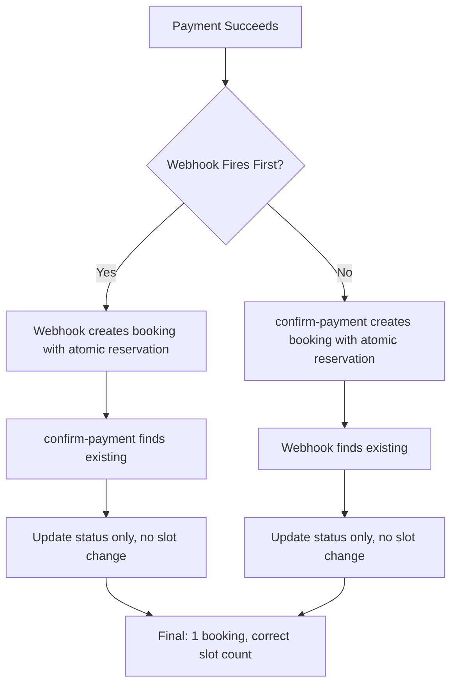

# Double Booking Fix - Duplicate Creation Prevention

## Date: March 7, 2026

## Problem Summary

Double bookings were still occurring even after implementing atomic slot reservation. Analysis revealed the issue was NOT a race condition in slot reservation, but **duplicate booking creation** through two separate code paths:

### Evidence from Logs

Two bookings created for same payment:

1. **Webhook** created: `69ac4362bd3280a452752a47` (status: confirmed)
2. **confirm-payment** created: `69ac4364bd3280a452752ac1` (status: pending)

### Flow Breakdown

```
1. User completes Stripe payment
2. Stripe webhook fires → payment_intent.succeeded event
3. Webhook creates booking with createBookingDirect()
   - Sets paymentInfo.stripePaymentIntentId
   - Status: confirmed
   - Slot count: 0 → 1 ✅

4. Client calls /api/payments/confirm-payment
5. Searches for existing booking using paymentInfo.paymentIntentId
6. Doesn't find it (field name mismatch!)
7. Creates NEW booking
   - Sets paymentInfo.paymentIntentId
   - Status: pending
   - Slot count: 1 → 2 ❌ DOUBLE BOOKED
```

## Root Causes

### 1. Field Name Mismatch

**Webhook** stores payment intent as:

```typescript
paymentInfo: {
  stripePaymentIntentId: intent.id,
  // ...
}
```

**confirm-payment** searches for:

```typescript
Booking.findOne({
  "paymentInfo.paymentIntentId": paymentIntent.id, // Different field!
});
```

Result: Existing booking not found → duplicate created

### 2. Unnecessary Duplicate Slot Updates

The confirm-payment endpoint was updating slot counts even when the booking already existed (created by webhook). This caused:

- Webhook: slot 0 → 1 (correct)
- confirm-payment: slot 1 → 2 (duplicate)

## Solution Implemented

### Fix 1: Unified Field Name Search

Updated `confirm-payment` to search BOTH field names:

```typescript
const existingBooking = await Booking.findOne({
  $or: [
    { "paymentInfo.paymentIntentId": paymentIntent.id },
    { "paymentInfo.stripePaymentIntentId": paymentIntent.id }, // ✅ Added
  ],
});
```

### Fix 2: Skip Slot Updates for Existing Bookings

When booking exists (created by webhook):

- Update payment status only
- **DO NOT** update slot counts (already done during creation)

```typescript
if (wasAlreadyConfirmed) {
  console.log("[PAYMENT] ✅ No action needed - webhook already processed");
  // No slot update!
} else {
  existingBooking.paymentInfo.paymentStatus = "succeeded";
  await existingBooking.save();
  console.log("[PAYMENT] ⚠️ Slot already reserved - NOT updating again");
  // No slot update!
}
```

### Fix 3: Use Atomic Reservation for New Bookings

If webhook hasn't fired and booking doesn't exist, use atomic reservation:

```typescript
if (!existingBooking) {
  const savedBooking = await BookingService.createBookingDirect({
    // Uses atomic slot reservation internally
    paymentInfo: {
      paymentIntentId: paymentIntent.id,
      stripePaymentIntentId: paymentIntent.id, // Set BOTH
      // ...
    },
  });
}
```

## Testing Verification

### Before Fix

```
Payment completed
→ Webhook creates booking (bookedCount: 0→1)
→ confirm-payment creates ANOTHER booking (bookedCount: 1→2)
→ Result: 2 bookings, bookedCount = 2 ❌
```

### After Fix

```
Payment completed
→ Webhook creates booking (bookedCount: 0→1)
→ confirm-payment finds existing booking
→ Updates payment status only
→ Result: 1 booking, bookedCount = 1 ✅
```

## Files Modified

- `server/src/controllers/payment.controller.ts`
  - Updated `confirmPayment()` to search both field names
  - Removed duplicate slot count updates
  - Use atomic reservation for new bookings only

## Previous Fixes (Still Active)

1. **Atomic Slot Reservation** (from earlier fix)
   - Prevents race conditions during concurrent bookings
   - Still active in `BookingService.createBookingDirect()`
2. **Rollback Mechanism** (from earlier fix)
   - Releases slot if booking creation fails
   - Still active in booking creation flow

## Complete Flow Now



## Deployment Notes

1. **No Database Changes**: Uses existing schema
2. **Backward Compatible**: Handles both old and new field names
3. **Idempotent**: Safe to call confirm-payment multiple times
4. **Monitoring**: Look for these logs:
   ```
   ✅ No action needed - webhook already processed
   ⚠️ Slot already reserved - NOT updating again
   ✅ Booking created with atomic slot reservation
   ```

## Related Files

- `RACE_CONDITION_FIX.md` - Atomic reservation implementation
- `BOOKING_DATE_FIX.md` - Previous date-related fixes
